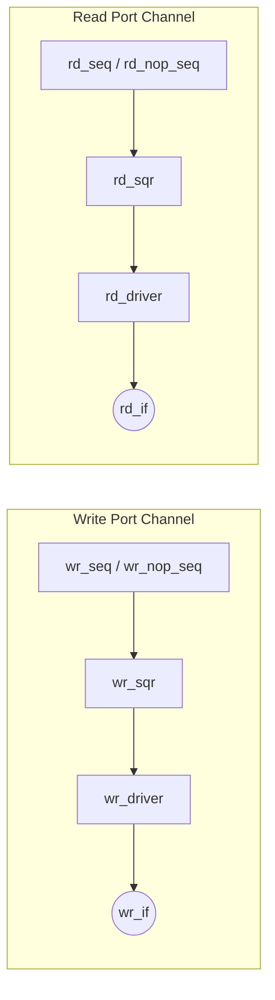

# 隔离化 UVM 架构重构方案 (Decoupled Single-Port Architecture)

## 1. 设计目标与隔离思想 (Isolation Strategy)
当前的验证环境将 Port A 和 Port B 强耦合在一个统一的 `mem_item` 和 `mem_if` 中，这导致了 UVC 对具体 SRAM 配置 (SP/SDP/TDP) 存在强依赖。
为了**将当前工程与其他隔离**，实现组件的极致复用，我们将采取彻底解耦的架构策略：
- **UVC 层级隔离**：UVC (`mem_agent`, `mem_item`, `mem_driver`) 彻底退化为**单端口泛型模型**。UVC 内部不再有 `port_a` / `port_b` 的概念，只有统一的读写信号。
- **环境层级组装**：通过在 `mem_env` 和 `tb_top` 中实例化多个 agent 和 interface（例如 `wr_agent` 和 `rd_agent`），像搭积木一样组合出双端口测试环境。

## 2. 核心架构拓扑

根据您的草稿，数据流与控制流将遵循以下严格隔离的路径：



## 3. 详细改造计划 (Proposed Changes)

### 3.1 接口层重构 (Interface)
#### [MODIFY] `verif_env/tb/mem_if.sv`
将现有的双端口信号重构为纯粹的单端口总线信号：
```systemverilog
interface mem_if #(parameter AW = 10, parameter DW = 32)(
    input logic clk,
    input logic rst_n
);
    logic          ce;        // Chip Enable
    logic          we;        // Write Enable (0=Write, 1=Read) - 替换原有的cmd
    logic [AW-1:0] addr;      // Address (新增，草稿中遗漏但必须具备)
    logic [DW-1:0] wem;       // Write Enable Mask
    logic [DW-1:0] wdata;     // Write Data
    logic [DW-1:0] rdata;     // Read Data from DUT
    logic [DW-1:0] rdata_exp; // Expected Read Data (Golden Reference)
endinterface
```
#### [MODIFY] `verif_env/tb/tb_top.sv`
不再实例化单一的 `vif`，而是根据测试需求实例化多个独立的端口：
```systemverilog
    mem_if #(AW, DW) wr_if(.clk(clk_a), .rst_n(rst_n));
    mem_if #(AW, DW) rd_if(.clk(clk_b), .rst_n(rst_n));
```

### 3.2 UVC 模型重构 (Sequence Item)
#### [MODIFY] `verif_env/uvc/classes/mem_item.sv`
删除所有 `_a` 和 `_b` 的后缀，退化为标准的单端口 Transaction：
```systemverilog
    rand logic          ce;
    rand logic          we;
    rand logic [AW-1:0] addr;
    rand logic [DW-1:0] wdata;
    rand logic [DW-1:0] wem;
    logic      [DW-1:0] rdata;
```

### 3.3 驱动层与代理层重构 (Driver & Agent)
#### [MODIFY] `verif_env/uvc/classes/mem_driver.sv`
- 恢复为单 `seq_item_port` 标准驱动架构。
- Driver 内部只负责解析 `mem_item` 并将其直接打到绑定的 `virtual mem_if` 上。不需要处理多端口逻辑。

#### [MODIFY] `verif_env/uvc/classes/mem_agent.sv`
- 内部仅包含一个 `sqr` 和一个 `drv`。Agent 本身变得极其轻量且通用。

### 3.4 顶层环境与测试重构 (Env & Test)
#### [MODIFY] `verif_env/uvc/classes/mem_env.sv`
组装隔离后的 Agents：
```systemverilog
    mem_agent #(AW, DW) wr_agent;
    mem_agent #(AW, DW) rd_agent;
```
#### [MODIFY] `verif_env/tests/classes/test_mem_*.sv`
测试用例中按需派发 Sequence。例如在 TDP 测试中：
```systemverilog
    wr_seq.start(env.wr_agent.sqr);
    rd_seq.start(env.rd_agent.sqr);
```

## User Review Required

1. **接口命名对齐**：草稿中定义了 `we` 和 `ce`。之前代码使用的是 `mem_cmd_e cmd` 形式。确认是否在 `mem_item` 和 `mem_if` 中全面切换为物理引脚语义的 `ce` (Chip Enable) 和 `we` (Write Enable, 0=写/1=读)？
2. **Golden 参考模型接入点**：草稿中在 `mem_if` 增加了 `rdata_exp`。这意味着 Golden Model 输出的 expected 数据会直接回填到 `mem_if.rdata_exp` 中，供独立挂载的 SVA Checker 直接使用。是否确认这种数据流向？

请确认以上架构梳理是否完全契合您的意图？确认后我将立即开始执行代码改造。
